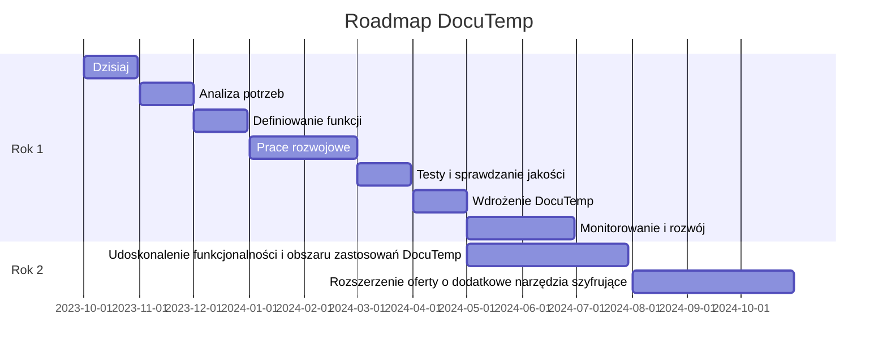
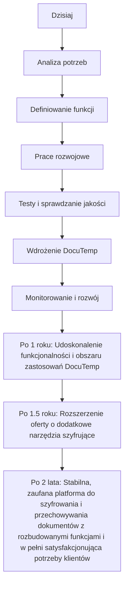

# [docs.veridock.com](http://docs.veridock.com)

+ [veridock.com](http://www.veridock.com)
+ [docs](http://docs.veridock.com)
+ [logo](http://logo.veridock.com)
+ [roadmap](http://roadmap.veridock.com)
+ [identity](http://identity.veridock.com)
+ [contriubtion](http://contriubtion.veridock.com)

---

+ [edit](https://github.com/veridock/docs/edit/main/README.md)
+ [git](https://github.com/veridock/)

# [docs.docutemp.com](http://docs.docutemp.com)

DocuTemp to bezpieczne i wydajne rozwiązanie do szyfrowania i przechowywania dokumentów projektowych w jednym dokumencie HTML, co czyni go idealnym wyborem dla firm wymieniających wrażliwe dane i stanowi silną alternatywę dla polegania na serwerach centralnych lub zewnętrznych aplikacjach do przechowywania i szyfrowania danych.

Do czego służy? 
+ szyfruje i przechowuje dokumenty projektu w jednym pliku html.

Dla kogo?
+ firm i osób, które potrzebują bezpiecznie wymieniać wrażliwe informacje przez popularne komunikatory.

Alternatywa?
+ dla tradycyjnych metod polegających na korzystaniu z centralnych serwerów lub zewnętrznych aplikacji do przechowywania danych i szyfrowania.

--- 
EN

DocuTemp is a secure and efficient solution for encrypting and storing project documents in a single HTML document, making it an perfect choice for businesses that exchange sensitive data and is a strong alternative to relying on central servers or external applications for data storage and encryption.

What it does? 
+ DocuTemp encrypts and stores project documents in a single html file.

Who it's for? 
+ It's designed for businesses and individuals who need to exchange sensitive data securely.

Alternative to?
+ DocuTemp is a compelling alternative to conventional methods that rely on central servers or external applications for data storage and encryption.

---

### O czym myślą klienci?

*co może pomyśleć klient firmy, która nie szyfruje danych księgowych i osobowych?*

Osoba (klient) takiej firmy może czuć się nieswojo, gdy dowiaduje się, że firma nie szyfruje danych księgowych czy osobowych. Może to wywołać obawy o to, jak bezpieczne są ich informacje i czy nie zostaną skradzione lub wykorzystane w niewłaściwy sposób. Brak szyfrowania danych może wskazywać, że firma nie traktuje bezpieczeństwa informacji swoich klientów na tyle poważnie, na ile powinna. Klient może zatem zastanowić się, czy powinien dalej korzystać z usług takiej firmy.

Bezpieczeństwo danych jest istotnym czynnikiem budującym zaufanie klienta do firmy. Klient może mieć wątpliwości co do profesjonalizmu firmy, która nie zapewnia wystarczającej ochrony wrażliwych danych. W rezultacie, może to zaszkodzić reputacji firmy i utrudnić jej pozyskiwanie nowych klientów.

Dodatkowo, klient może zastanawiać się, czy firma spełnia wymogi prawne dotyczące ochrony danych, co może narażać go na ryzyko prawne. Dowiedzenie się, że firma nie szyfruje danych, może skłonić klienta do zgłoszenia tego odpowiednim organom regulacyjnym.

### Prywatność traci się tylko raz

*dialog dwóch osób, w której jedna opowiada drugiej, jak istotne jest bezpieczeństwo*

- **Anna**: Cześć Kamil, przy okazji ostatniej rozmowy, chciałam ci powiedzieć o ochronie danych w naszej firmie.

- **Kamil**: Pewnie, opowiedź!

- **Anna**: Czy zdajesz sobie sprawę, jak istotne jest bezpieczeństwo danych, zwłaszcza tych wrażliwych czy poufnych, jak informacje o naszych klientach?

- **Kamil**: No wiem, że to ważne, ale my używamy hasła i zabezpieczeń, prawda?

- **Anna**: Tak, ale to nie zawsze wystarcza. Hasło to tylko jedna warstwa ochrony. To, co jest naprawdę kluczowe teraz, to szyfrowanie danych. 

- **Kamil**: Co to dokładnie oznacza?

- **Anna**: Oznacza to, że informacje są zamieniane na kod, który można zrozumieć tylko posiadając odpowiedni klucz. Bez tego, dane są bezużyteczne dla kogoś, kto je przechwyci.

- **Kamil**: Rozumiem. Ale ile razy słyszałeś o firmach, które miały z tym problem?

- **Anna**: Oj, nie chciałbyś tego wiedzieć... **prywatność traci się tylko raz**. Jeśli dojdzie do wycieku danych, szczególnie tych wrażliwych, konsekwencje mogą być katastrofalne. Strata reputacji, kary finansowe, utrata zaufania klientów.

- **Kamil**: Skoro tak mówisz, to brzmi poważnie. Zaczynam rozumieć, dlaczego tak podkreślasz to bezpieczeństwo.

- **Anna**: Dokładnie, Kamil. Zawsze lepiej zapobiegać, niż leczyć. A gdy chodzi o bezpieczeństwo danych, nie ma czegoś takiego jak zbyt dużo ostrożności.

---

### Możliwości DocuTemp:

- Wymiana danych z księgowym, faktur, raportów, danych medycznych, pracowników bez obawy o ich utratę czy wyciek do osób niepowołanych
- Podpisywanie i monitorowanie realizacji umów asynchronicznie, bez konieczności utrzymywania stałego połączenia
- Archiwizacja danych, umożliwiająca bezpieczne przenoszenie między różnymi urządzeniami, np.: PC i USB
- Możliwość korzystania z mniej bezpiecznych kanałów komunikacji wysyłając dane wrażliwe w postaci zaszyfrowanej

### Jakie korzyści przyniesie Wam DocuTemp?

- Dostęp do wszystkich dokumentów w jednym przenośnym pliku html, to większy porządek i łatwość w zarządzaniu danymi.
- Pełna kontrola - wszystko jest w 100% w Państwa rękach - nie jest wymagany centralny serwer do przechowywania danych i haseł.
- DocuTemp działaj na każdym systemie operacyjnym i przeglądarce, a edycja danych jest możliwa bezpośrednio w przeglądarce internetowej bez potrzeby instalowania zewnętrznych aplikacji.

DocuTemp to przede wszystkim bezpieczeństwo - wszystko odbywa się po stronie przeglądarki w języku JavaScript, a dokumenty są przechowywane w formacie HTML, co gwarantuje niezależność od zewnętrznych aplikacji.

W DocuTemp zapewniamy pełne bezpieczeństwo wymiany danych, archiwizacji dokumentów czy realizacji usług. Podejmujemy wszelkie działania, aby unikać ryzyka wycieku informacji - ograniczamy ryzyko do minimum, dzięki czemu można skupić się wyłącznie na realizacji swoich celów biznesowych.

### Zastosowanie:

Za sprawą DocuTemp można realizować prace wymagające dostępu do wrażliwych danych w pełni zdalnie, bez obaw o wyciek danych, kompromitację, kary (RODO).
Od bezpiecznej pracy zdalnej po delegowanie zadań monotematycznych czy wymianę dokumentów, DocuTemp to klucz do skutecznego, szyfrowanego i bezpiecznego zarządzania dokumentami w Państwa firmie.

## Oferta

Hasło: 'Szyfrowany Projekt', 'Szyfrowany Projekt', 'Szyfrowane Portfolio', 'Szyfrowany portfel danych'
Motto: 'Twoje Dane, Twoja Kontrola'
Wizja: 'Tworzenie bezpiecznego, skutecznego i wydajnego narzędzia komunikacji umożliwiającego gwarantowane przechowywanie i szyfrowanie informacji w jednym pliku. '
Strategia: 'Inwestowanie w innowacje technologiczne i ciągłe doskonalenie naszej platformy, aby zapewnić naszym klientom najwyższy poziom ochrony ich wrażliwych danych.'
Misja: 'Wzmacnianie firm i osób prywatnych poprzez dostarczanie wysoce bezpiecznego i wydajnego narzędzia do przechowywania i szyfrowania ich dokumentów projektowych, promowanie prywatności danych i zmniejszanie zależności od centralnych serwerów lub zewnętrznych aplikacji do przechowywania i szyfrowania danych.'

Catchphrase: 'Encrypted Portfolio', 'encrypted pocket', 'encrypted files', 'encrypted folder', 'Encrypted data wallet'
Motto: 'Your Data, Your Control'
Vision: 'Creating a secure, effective, and efficient communication tool that guarantees secure storage and encryption of information in a one file.'
Strategy: 'Investing in technological innovation and continually improving our platform to provide our customers with the highest level of protection for their sensitive data.'
Mission: 'To empower businesses and individuals with a highly secure and efficient tool for storing and encrypting their project documents, promoting data privacy and reducing the reliance on central servers or external applications for data storage and encryption.'

### Rozwiązanie:

+ szyfrowanie i przechowywanie dokumentów projektu w jednym dokumencie html

### Cel:

+ do wymiany danych w formie zaszyfrowanej
+ do realizacja usług w sposób asynchroniczny

  
### Zastosowanie:
+ Wymiana danych z księgowym, faktur, raportów, danych medycznych, pracowników
+ Podpisywanie i monitorowanie realizacji umów asyncrhoczninie (i syncrhonicznie na serwerze)
+ Archiwizajca danych, np. przenoszenie między PC i USB danych w formie zaszyfrowanej
+ mozliwosc korzystania z mniej bezpiecznych kanalow komunikacji wysyłając dane wrażliwe w postaci zaszyfrowanej

  
### Korzyści
+ jeden przenośny dokument jako portfel dla wielu dokumentów
+ bez centralnego serwera przechowującego dane i hasła
+ Kontrola zmian, danych
+ działa na każdego platformie i przeglądarce
+ edycja danych bezpośrednio w przeglądarce internetowej bez zewnętrznej aplikacji

  
### Specyfikacja:

+ dokument w formacie HTML, dlatego nie wymaga zewnętrznej aplikacji
+ aktywne elementy i szyfrowanie obsługiwane po stronie przeglądarki w języku JavaScript
+ możliwość synchronizacji z zewnętrznymi i lokalnymi usługami na serwerze, komputerze użytkownik, np. w celu aktualizacji statusu kontraktu
+ możliwość załączenia i uruchomienia w komunikatorze do przeglądu lub edycji w prywatnym oknie

## Historia powstania
Szukając rozwiązania dla wymiany danych z księgowym, znalazłem webowe narzędzia do  szayfrowania plików:

+ [Hat.sh - Simple, fast, secure client-side file encryption](https://hat.sh/)
+ [DocuCrypt - ENCRYPTS & DECRYPTS YOUR PRIVATE FILES](https://www.docu-crypt.com/)

Oprócz szyfrowania danych przesyłanych między dwoma komputerami/osobami, chciałem automatyzować zbieranie faktur z emaili i stron www providerów online.
+ nie da się tego zrobić za pomocą dostępu do API, bo nie każdy provider usług online ma takie rozwiązanie

dlatego trzeba to zrobić ręcznie ...
+ i jak to zrobić nie znając haseł do tych providerów?

## Usługi płatne, 10PLN/msc/użytkownik

### Contract Status - veridock.com

Sprawdzanie statusu umowy, nazdorowanie checklist

### One time safe

jednorazowy sejf

+ Możliwość przechowywania zaszyfrowanego pliku w jednorazowym sejfie, to znaczy, że można zaszyfrowany dokument upload-ować aby druga osoba po podaniu hasła mogła go pobrać

Skrytka w tym momencie zostaje usunięta z serwera, a dokument pozostaje u nadającego i odbierającego.
Nikt inny nie ma dostępu, nawet po włamaniu na komputer w trakcie działania przeglądarki plik pozostaje zaszyfrowany, a hasło do otworzenia posiadają dwie strony kontraktu

+ możliwość wyboru lokalizacj, w którrj znajduje się serwer VPN oraz docelowa baza danych
  

## Przykładowe zastosowania 

### Udostępnianie ekranu: 
Podczas spotkań online lub prezentacji często udostępniamy swój ekran. W przypadku, gdy niezamknięty komunikator z dokumentem lub wiadomością jest widoczny, treści te mogą zostać ujawnione innym uczestnikom spotkania.

### Wspólne korzystanie z komputera: 
Jeżeli współpracownicy lub inne osoby mają dostęp do naszego komputera, mogą zobaczyć otwarte dokumenty lub wiadomości.

### Niezabezpieczony komputer: 
Komputer, który pozostawimy niezabezpieczony i nienadzorowany, może umożliwić niepowołanym osobom dostęp do naszych dokumentów i wiadomości.

### Inwigilacja: 
Są osoby lub firmy, które specjalizują się w inwigilacji i kradzieży danych. Upewnij się, że twój system jest chroniony przed takim działaniem.

Konsekwencje prawne mogą obejmować kary naruszenia prywatności, naruszenia praw autorskich, jeśli dokumenty są chronione prawem autorskim, a także ewentualne procesy sądowe ze strony osób, których prywatność została naruszona.

Konsekwencje biznesowe mogą obejmować utratę zaufania klientów, straty finansowe z powodu kradzieży ważnych informacji biznesowych, utratę konkurencyjności, jeśli wrażliwe informacje dotyczące strategii biznesowej lub produktu są ujawnione, a także negatywne konsekwencje dla reputacji firmy.

### Zdarzenia wycieku wrażliwych danych

#### Wyciek danych z komunikatora: 
W 2019 roku, Jeff Bezos, CEO Amazona, padł ofiarą ataku hackerskiego na komunikator WhatsApp, który doprowadził do kradzieży jego prywatnych danych. DocuTemp zapewnia kontrolę nad dostępem do dokumentów - można je udostępniać innym użytkownikom tylko w określonym zakresie, co ogranicza ryzyko ich wycieku.

#### Udostępnianie ekranu podczas spotkań online:
W 2017 roku, Elon Musk, CEO SpaceX i Tesla, w czasie prezentacji w sieci przypadkowo pokazał swoją korespondencję dotyczącą spraw firmowych, po udostępnieniu swojego ekranu. 

#### Wspólne korzystanie z komputera:
Były dyrektor Yahoo, Scott Thompson, stracił pracę, gdy w jego CV odkryto błędy. Okazało się, że zostały one dodane przez współpracownika, który miał dostęp do jego komputera.

#### Niezabezpieczony komputer: 
W 2016 roku, komputer należący do Johna Podesty, szefa kampanii wyborczej Hillary Clinton, został zhakowany, ponieważ został pozostawiony niezabezpieczony. Wynikło z tego ujawnienie wielu poufnych wiadomości e-mail.

#### Wyciek danych klientów PZU
w 2013 r. doszło do wycieku danych osobowych oraz numerów polis około 5 tysięcy klientów PZU. 
Wszystko z powodu błędu pracownika, który przypadkowo wysłał e-maile z załącznikami zawierającymi te dane do nieuprawnionych osób. 
Korzystanie z DocuTemp, pozwalającego kontrolować dostęp do danych i uprawnienia do ich udostępniania, mogłoby zapobiec takiej sytuacji.

#### Wyciek danych klientów Play
W 2017 r. około 4 miliony klientów sieci komórkowej Play padło ofiarą wycieku danych. Wyciek obejmował m.in. numery PESEL, numery telefonów oraz adresy e-mail. 
DocuTemp, poprzez umożliwienie bezpiecznego przechowywania i udostępniania dokumentów, mógłby zapobiec takiej sytuacji.

#### Wyciek danych klientów sieci Orange
w roku 2019 dane klientów Orange Polska, a konkretnie daty ważności ich umów na telewizję i internet, popadły w niepowołane ręce. 
Cyfrowa administracja dokumentami jaką proponuje DocuTemp mogłaby skutecznie zapobiec takiej sytuacji.
 

### Przykłady zdarzeń zabezpieczanych przez DocuTemp

#### Kradzież lub zgubienie urządzenia: 

+ Wyciek danych z pendrive'a

W 2014 roku zawierający dane osobowe 6 milionów obywateli Chile pendrive został zgubiony przez urzędnika rządowego. Informacje obejmowały m.in. nazwiska, numery identyfikacyjne oraz adresy e-mail osób. DocuTemp zabezpiecza dokumenty na każdym nośniku, umożliwia również przechowywanie w jednorazowym schowku online w zaszyfrowanych dokumentów w bezpiecznej infrastrukturze chmurze, co eliminuje potrzebę korzystania z nośników przenośnych, takich jak pendrivy, które mogą zostać zgubione lub skradzione.

Rozwiązanie:

Pracownicy często pracują zdalnie lub na wyjazdach. Jeśli laptop lub telefon pracownika zawierający ważne dokumenty firmy zostanie skradziony lub zgubiony, mogą z tego wyniknąć poważne konsekwencje. DocuTemp pozwala przechowywać dokumenty w chmurze, co oznacza, że nawet jeśli urządzenie zostanie utracone, dane nie zostaną utracone ani nie będą dostępne dla niepowołanych osób.

#### Błędne udostępnianie dokumentów: 

+ Wyciek danych z klienta poczty e-mail

W 2013 roku, Yahoo ujawniło, że dane 3 miliardów użytkowników zostały skradzione w ataku na ich klienta poczty e-mail. DocuTemp zapewnia szyfrowanie danych po stronie klienta, co oznacza że nawet jeśli dane zostaną przechwycone, nie będą czytelne bez klucza.

Rozwiązanie:

Pracownicy często muszą współdzielić dokumenty. Jeśli dokument zostanie przypadkowo przesłany do nieodpowiedniej osoby, może to prowadzić do wycieku informacji. 
DocuTemp pozwala kontrolować, kto ma dostęp do danego dokumentu, co minimalizuje ryzyko jego niewłaściwego udostępnienia.

Szyfrowanie po stronie klienta DocuTemp oznacza, że dane są szyfrowane na urządzeniu użytkownika, zanim zostaną wysłane do chmury. To ogranicza ryzyko, że dane będą przechwycone i odczytane podczas transmisji. Ponadto, klucz do odszyfrowania danych jest przechowywany tylko na urządzeniu użytkownika, co daje dodatkową warstwę ochrony.

#### Brak kopii zapasowych: 

+ Ataki phishingowe

Małe firmy często nie mają wystarczających zabezpieczeń przeciwko cyberatakom.
Pracownicy mogą nieświadomie kliknąć na link w oszukańczym e-mailu, co pozwoli hakerom na dostęp do systemu firmy. 

Rozwiązanie:

W małych firmach nie zawsze są tworzone regularne kopie zapasowe danych, co naraża firmę na ryzyko utraty ważnych informacji w wyniku awarii sprzętu czy ataku ransomware.
DocuTemp oferuje szyfrowanie danych po stronie klienta, co ogranicza ryzyko, że dane będą przechwycone i odczytane przez niepowołane osoby.
Usługa jednorazowego Sejfu DocuTemp automatycznie tworzy kopie zapasowe przechowywanych dokumentów, co gwarantuje ich bezpieczeństwo i nie przechowuje danych na zewnętrznym serwerze dłuzej niż to potrzebne, minimalizując ryzyko na kilku poziomach, czasu, formatu i dostępu osób.

### Korzyści dla Waszych klientów

Zdecentralizowane systemy szyfrowania wpływają na postrzeganie firmy przez klientów jako bezpiecznej i odpowiedzialnej. 
Takie systemy zwiększają zaufanie klientów, ponieważ pokazują, że firma traktuje ochronę ich danych poważnie i zastosowała zaawansowane technologie bezpieczeństwa. 

Dla potencjalnych klientów to może stanowić decydujący czynnik podczas wyboru między różnymi firmami oferującymi porównywalne produkty czy usługi. 
Klienci są coraz bardziej świadomi ryzyka związanego z bezpieczeństwem danych i oczekują od firm zabezpieczeń na najwyższym poziomie. 

W przypadku konsekwencji prawnych, zastosowanie zdecentralizowanego systemu szyfrowania może pomóc firmie w spełnieniu wymogów rozporządzenia o ochronie danych osobowych (GDPR). 
To może pomniejszyć ryzyko nałożenia kar wynikających z naruszenia zasad ochrony danych.

W kwestii ubezpieczeń, firmy, które korzystają z tych systemów, mogą często otrzymać korzystniejsze warunki od ubezpieczycieli związane z polisami od odpowiedzialności cywilnej czy polisami cyberbezpieczeństwa. 
Ubezpieczyciele mogą uznać, że takie firmy są mniej narażone na ryzyko związane z wyciekiem danych, co oznacza niższe składki ubezpieczeniowe.

 

### Realizacja usługi online

+ umawiam się na 15minut na sesję remote desktop, czyli osoba udostępniająca PC ma pełen wgląd co robię i daje mi tylko prawo do przeglądarki, bez możliwosci przesyłania danych pomiędzy komputerami
+ manualnie łącze się do komputera sekretarki, na którym są przechowywane hasła dostępowe (password manager) do listy serwisów, które powinny zaiwerać np. dokumenty, faktury
+ zbieram te dane do jednego pliku html lokalnie i zabezpieczam hasłem, po czym wysyłam poprzez email (edykowany do faktur), lub zostawiam na dysku komputera

tak wygląda to dziś, w przyszłości można to w pełni zautomatyzować
sensem tego rozwiązania jest makysmalne ograniczenie ryzyka przy pracach wymagających dostępu do wrażliwych danych, aby dziś oferować usługę automatyzacji, bez potrzeby pytania o hasła

to tylko przykład jednego z zadań, które wymaga wejścia na czyiś komputer w sposób bezpieczniejszy, tzn bez prawa do używania dysku i tylko jednej aplikacji - przeglądarki www z już zapisanymi hasłami, więc ja mogę używać np. Firefox z zapisanymi hasłami i nie będę w stanie podejrzeć tych danych, bo są zabezpieczane password master
z drugiej strony mogę korzystać z sieci i myszki (bo klawiatura nie jest potrzebna)

bo hasło i tak wpisuje osoba dla której to robię, ja tylko występuje w formie BOTa do klikania w odpowiednie linki i zapisywania danych na dysk komputera klienta i na nim upload do dokumentu w którym będą przechowywane te zaszyfrowane już pliki do wysyłki

### Outsourcing

Tego typu zadani może robić osoba z firmy, ale dzięki szyfrowaniu może być prowadzony bezpieczny outsource sekretarki i księgowego w takiej klikającej formie jeśli mowa o zasobach wrażliwych
zyskujesz szybką realizację takich monotonnych zadań bez ryzyka, że ktoś będzie miał dostęp do danych wrażliwych

### Checklist'a

monitorowanie wykonania zadania w czasie rzeczywistym
W dokumencie HTML znajduje się checklista z linkami i jeśli wszystko zostanie powyklikane, pobrane i załadowane do postaci zaszyfrowanej to trafia do ksiegowego lub w inne miejsce też w takiej formie w dowolny sposób.

### Praca grupowa

Aktualnie są dwie strony kontraktu, ale mozna to poszerzyc do 3-4 i wowczas kazdy bedzie odpowiedzialny za swoja checkliste
takie rozwiązanie otwiera mozliwości realizacji customizowanych usług, ktróe można monitorować, bo to czy kliknąłeś link i uploadowałeś go krok po kroku można sprawdzić
bo pozostaną metadane i ta checklista wbudowana w ten dokument moze byc wysyalana na serwer, aby podejrzec stan jesli ktoś z zewnątrz chciałby wiedzieć, np wlasciceil firmy, czy dokumenty zostaly pobrane i wyslane, bo potem ten dokument moze otworzyc księgowy i potwierdzić ze odebrał

### Usprawnienia
do tego celu można też udostępnić specjalny komputer w firmie, w ramach zwiększania bezpieczeństwa i go wpinać jak jest potrzebny
można poszerzyć zakres usług i nawet podpinać synchronizację z księgowymi i być partnerem wielu księgowych

## Bezpieczna wymiana dokumentów

Szyfrowanie kanałów komunikacji to minimum do którego przywykliśmy.
Niestety nie zawsze to wystarczy, zwłaszcza gdy możemy stać się ofiarą luki w oprogramowaniu, np. backdoory czy ciągłej infiltracji ze strony rządu polegającej na archiwizownaiu wiadomości przez providerów usług komunikacji.

Przechowywanie danych na prywatnym urządzeniu pc, smartphone czy pendrive z podaniem hasła dostępu do całego systemu czy dysku może nie być wystarczające, jeśli dostęp do urządzenia ma strona trzecia poprzez celowo pozostawione luki w systemie.

To co może pomóc w takich skrajnych, ale zdarzających się sytuacjach, to pozostawianie danych w formie zaszyfrowanej na dysku, nawet wtedy gdy system jest zabezpieczony hasłem.

W sytuacji zagrożenia życia, takie różnice pomagają w zachowaniu życiua swojego i innych osób narażonych na wyciek danych.

Na co dzień jednak nie chcemy aby the luki bezpieczeństwa pozwalałby na dostęp konkurencji, czy grup posuwających się do przestępstwa i łamania tajemnicy korespondencji gwarantowanej nam w konstytucji.

## Oferta

FinOfficer to narzędzie do transparentnej dla obu stron komunikacji a zarazem szyfrowanej dla osób postronnych.
Komunikacja może odbywać się za pomocą dowolnego medium, ale sama treść wiadomości i załączników może zostać zaszyfrowana.

Taka forma komunikacja wymaga prostego narzędzia dlatego korzystamy z narzędzia DocuTemp do tworzenia dokumentów w locie z szyfrowaniem.
   
Plik który przesyłamy w koresponendcji jest formacie HTML a do otwarcia wymaga tylko przeglądarki i hasła, po  realizacji zdalnych usług

+ Szyfrowanie to tylko warstwa niezalezna od kanalu komunikacji
+ Plik HTML to typ MIME multipart z plikami wbudowanymi do html

## Zastosowanie

+ tworzenie umów pod customizowane pod klienta usługi online/offline
+ Wbudowana checklista kolejnych kroków, potwierdzanych przez zlecającego wykonanie usług
+ Potem edycja i ponowne zapisanie, zaszyfrowanie i wyslanie zmian
+ Możliwość przechowywania zaszyfrowanego pliku w jednorazowym sejfie

HTML multipart zawiera wbudowanych w html dowolne pliki projektu potrzebnego do realizacji usługi: png, doc, png, md, ...

Chodzi o to by na dysku nie bylo sladu po sourcode, zeby te wazne pliki byly wbudowane wewnatrz html w sposob zaszyfrowany i tylko otworzenie dokumentu w przegladarce pozwoli na zobaczenie co tam jest po podaniu hasla
Taki dokument zaszyfrowany html ma miec tez niezaszyfrowane dane jak status do umowy
Czyli Ty mi wysylasz zlecenie, umowe w formacie html z checklista, ja odbieram i poprzrz wygenerowany klucz otwieram dodaje pliki poprzez funcke upload i wysylam Tobie zaznaczajac zmiane statusu i rozpoczecie kolejnego etapu
Ty odbierasz html z zalacznikami w nim i po otrzymaniu klucza otwierasz i potwierdzasz lub nie ten etap, zalaczasz jakies wskazowki i plik znowu wraca do mnie, na koniec jak wszystkie checkbosy statusu zlecenia beda zaznaczone i potwierdzone jako zweryfikowane automatycznie wysylasz kase z depozytu
Chodzi o to by kontrolowac przebieg prac nad projektem i nie zmieniac kryteriow wykonania w trakcie, aby byla to transparenta umowa dla obu stron
Ta checklista aktualnie zapisuje sie w cookies i jesli jest dostepny na zdalnym serwerze, ale sam dokument nie jest przechowywany na serwerze
Jedynie template
A co pomiedzy sie w nim zmiesci nie jest nikomu znane Oprocz dwom stronom umowy

## Kto może skorzystać z rozwiązania DocuTemp?

Chociaż prawie każdy zawód może korzystać z korzyści płynących ze szyfrowania w pewnym momencie, istnieją pewne grupy zawodowe, dla których jest to szczególnie istotne. 
Oto kilka przykładów:

#### Pracownicy służb zdrowia
- Lekarze, pielęgniarki i personel administracyjny w placówkach medycznych mają dostęp do poufnych informacji o zdrowiu pacjentów, które zgodnie z prawem muszą być chronione.

*Ochrona **prywatności pacjentów** wymaga szyfrowania danych, bo lepiej zapobiegać niż leczyć.*

#### Adwokaci, prawnicy, ubezpieczyciele
- Muszą chronić prywatność swoich klientów i informacje związane z przypadkiem, a często zdarza się, że posiadają bardzo wrażliwe informacje.

*Poufne **informacje o klientach** powinny pozostać zaszyfrowane, tak na wszelki wypadek...*

#### Pracownicy rządowi i urzędnicy
- Właściwe szyfrowanie jest niezbędne dla tych, którzy mają dostęp do ważnych i czasem bardzo wrażliwych informacji rządowych.

*Bezpieczeństwo informacji państwowych to często ochrona własnego stołka, w czasie **inwigilacji** służb lepiej spać spokojnie...*

#### Pracownicy przemysłu finansowego
- Bankierzy, doradcy finansowi, księgowi - wszyscy oni codziennie pracują z poufnymi danymi finansowymi, które należy chronić.

* **Dane finansowe** klientów są bezcenne, upewnij się, że są szyfrowane jak w banku!*

#### Dziennikarze
- Dziennikarze często pracują z poufnymi źródłami i muszą chronić tożsamość tych źródeł oraz informacje, które od nich otrzymują.

*Dziennikarstwo wymaga ochrony źródeł, poufnych danych i zachowania **anonimowości informatorów**, lepiej trzymać pliki na kłódkę!*

#### Specjaliści IT i cyberbezpieczeństwa
- Są odpowiedzialni za ochronę sieci i systemów przed atakami, a także za bezpieczne przechowywanie danych w swoich systemach.

*Szyfrowanie danych pozwoli przetrwać bez objawowo: wirusy, ataki ransomware, **wycieki danych** dataleaks, ...

### Grupy niezawodowe, które mogą potrzebować szyfrowania

#### Organizacje pozarządowe (NGO)
- Często pracują z wrażliwymi danymi, które mogą być na celowniku władz lub hakerów. 

*Działaj bezpiecznie, szfyrowanie zabezpiecza realizowane **projekty** i wolontariuszy a tym samym środki wpływające od darczyńców*

#### Aktywiści i Lobbyści
- Osoby te często są narażone na śledzenie i inwigilację, dlatego powinni chronić swoją komunikację i dokumenty. 

*Twoja walka wymaga dyskrecji, zwłaszcza gdy, zleceniodawcy woleliby pozostać **anonimowi**...*

#### Grupy przestępcze
- często korzystają z szyfrowania, aby ukryć swoje działania.

*Chociaż nie popieramy nielegalnej działalności, rozumiemy, że **prywatność koresponencji** to prawo każdego, bez wyjątku!*

#### Osoby z zaburzeniami anankastycznymi (obsesyjno-kompulsyjnymi)
- Mogą odczuwać silną potrzebę utrzymania swoich danych w absolutnym porządku i bezpieczeństwie, co może prowadzić do decyzji o szyfrowaniu.

*Jeśli **bezpieczeństwo danych** jest Twoją obsesją, mamy dla Ciebie rozwiązanie, na którym możesz obsesyjnie polegać...*

# Use Case

## Kontrakt

Chodzi o mozliwosc korzystania z mniej bezpiecznych komunikacji informacji do celow zawierania umów i rozliczania, bez udzialu strony trzeciej, ktora udostepnia templates i hash do aktualizacji statusu, bez ktorego nie mozna samowolnie przejsc do nastepnego etapu
Osoba ktore zleca odpowiada za weryfikacje prac dlatego ona potwierdza checkliste i decyduje o wyplacie dlatego mozna tez zrobic umowe z wyplata zaliczek po zmianie kolejnych statusow
W tej chwili zakladam dwie strony umowy ale moze bedzie potrzebna rozbudowa
To moze dzialac online ale w skrajnosci musi byc mozliwosc pracowania na pliku offline bez dostepu do danych na urzadzeniu

## Fiverr

Korzystam z fiverr i tam jest chat, ja bym chcial aby to bylo w formie offline bez chatu a po prostu spakowana paczka na wszystko co da sie zdalnie wykonac

## Księgowość, wymiana dokumentów

To samo z moim ksiegowym
Nie chce by posiadal moje dokumenty na dysku w formie niezaszyfrowanej
Dlatego chce mu wysylac taka paczke do pobrania np z jednorazowego linku
Żebym tez mial informacje czy pobral w statusie dokumentu jaki mam u siebie
Wiec jesli bede chcial mu wyslac wiele dokumentow to bedzie mogl sobie to pobrac z linku i otworzyc na kompie a potem pokasować jak juz wprowadzi do systemu
Bo jak widze z jakich oni korzystaja klientow poczty
Np. o2, wp,...

## FAQ

Wykorzystanie DocuTemp, jak każdego innego programu, może wiązać się z pewnymi obawami oraz potencjalnymi pytaniami. 
Poniżej wymieniamy kilka z nich:

#### Bezpieczeństwo danych: 
DocuTemp przechowuje dane w pliku HTML, czy dane z dokumentów są widoczne po otwarciu okna edycji dokumentu?
Pliki są przechowywane wewnątrz pliku HTML typu mulipart, więc nie ma tam otwartych danych a jedynie zaszyfrowany tekst.
Nasze szyfrowanie jest na najwyższym poziomie i używamy zaawansowanych technologii do zapewnienia prywatności Twojego pliku.

#### Kompatybilność z przeglądarką: 
Czy mogą pojawić się problemy z otwarzaniem lub edytowaniem pliku HTML w różnych przeglądarkach?
DocuTemp jest jednak zaprojektowany tak, aby być kompatybilnym z większością popularnych przeglądarek.

#### Zarządzanie dużą ilością dokumentów: 
Jaki jest limit przechowywania danych?
DocuTemp został jednak zaprojektowany tak, aby umożliwić efektywne zarządzanie nawet ogromną liczbą dokumentów, limity są po stronie technicznej urządzenia, przeglądrki, dysku.

#### Trudności techniczne: 
Co mam zrobić w przypadku problemów, gdzie otrzymam pomoc?
Niektórzy użytkownicy mogą doświadczyć problemów technicznych, takich jak niemożność zapisania zmian czy błąd w szyfrowaniu. 
Nasz zespół wsparcia technicznego jest jednak dostępny, aby pomóc rozwiązać te problemy.

#### Problemy z dostępem do Internetu: 
DocuTemp wymaga nie wymaga dostępu do Internetu podczas działania, jedynie aktualizacji.

#### Potrzeba ciągłych aktualizacji: 
Aby utrzymać najwyższy poziom bezpieczeństwa i funkcjonalności, DocuTemp wymaga regularnych aktualizacji. 
Co nie przeszkadza w sytuacji gdy klienci mają publiczny dostęp do plików na stronie www lub prywatnie poprzez załączniki wysyałane zaraz po aktualizacji do każdego użytkownika.

## Konkurencja

Lista firm, które mogą stanowić konkurencję dla rozwiązania DocuTemp na poziomie globalnym, ale różnią nie szyfrują danych na dysku lokalnym

Większość firm nie zapewnia szyfrowania danych lokalnie, co oznacza, że dane są szyfrowane dopiero po przesłaniu ich na serwery firmy. m.in.

1. Microsoft Corporation - Microsoft 365
2. Google LLC - Google Drive
3. Dropbox, Inc.
4. Adobe Systems - Adobe Document Cloud
5. Zoho Corporation - Zoho Docs
6. Box, Inc.

   
Warto jednak zauważyć, że DocuTemp różni się od tych zasobów swoim unikalnym podejściem do bezpieczeństwa dokumentów, przechowując je jako zaszyfrowane pliki HTML, zamiast polegania na zewnętrznych serwerach czy platformach.

Większość z nich stosuje tzw. "szyfrowanie po stronie serwera", co oznacza, że nie są szyfrowane na urządzeniu użytkownika przed przesłaniem na serwer. 

Jednak, firmy takie jak Tresorit, Sync.com oraz SpiderOak zapewniają "szyfrowanie po stronie klienta", co oznacza, że dane są szyfrowane na urządzeniu użytkownika zanim zostaną przesłane do chmury.

ShareFile (Citrix) oferuje także możliwość szyfrowania lokalnego, ale ta funkcja jest dostępna tylko w niektórych planach. 

Jednak żadne z tych rozwiązań nie przechowuje danych w formacie HTML, jak to robi DocuTemp.

## Globalne marki, które zapewniają "szyfrowanie po stronie klienta

Wszystkie powyższe usługi oferują szyfrowanie po stronie klienta, co oznacza, że dane są szyfrowane na urządzeniu użytkownika przed przesłaniem do chmury. 

### Tresorit 
- Szwajcarska firma specjalizująca się w zabezpieczonym przechowywaniu danych w chmurze, które oferuje 'end-to-end' szyfrowanie.

### SpiderOak 
- Amerykańska firma oferująca usługi backupu i przechowywania danych w chmurze z 'end-to-end' szyfrowaniem.

### Sync.com 
- Kanadyjski dostawca usług przechowywania w chmurze, który oferuje 'end-to-end' szyfrowanie.

### Boxcryptor 
- Niemiecka firma specjalizująca się w zabezpieczeniu danych przechowywanych w popularnych usługach chmury za pomocą 'end-to-end' szyfrowania.

### ProtonMail 
- Szwajcarski dostawca zabezpieczonej poczty e-mail, której każdy e-mail jest szyfrowany na urządzeniu użytkownika przed wysłaniem.

### NordLocker 
- Jest to produkt od twórców popularnej usługi VPN, NordVPN, który umożliwia użytkownikom szyfrowanie plików na swoim urządzeniu przed ich udostępnieniem lub przeniesieniem do chmury.

### Signal 
- Popularna aplikacja do komunikacji, która stosuje 'end-to-end' szyfrowanie, co oznacza, że wszystkie wiadomości są szyfrowane na urządzeniu użytkownika przed wysłaniem. 

### Cryptomator 
- Wentylator open source, który oferuje szyfrowanie po stronie klienta dla danych przechowywanych w chmurze. 

## Roadmap

Ten diagram pokazuje, jak praca nad DocuTemp rozpoczyna się od analizy potrzeb użytkowników i rozwoju kluczowych funkcji, a następnie przechodzi przez różne etapy testowania, wdrożenia i rozwoju. DocuTemp stanie się stabilną i zaufaną platformą do szyfrowania i przechowywania dokumentów po dwóch latach ciężkiej pracy. 

Krok 1: Analiza potrzeb:

Rozpoczynamy od zrozumienia potrzeb naszych użytkowników - firmy, jednostki i innych klientów, które wymagają bezpiecznej wymiany danych. Gromadzimy informacje o tym, jakie są ich oczekiwania i wymagania.

Krok 2: Definiowanie funkcji:

Następnie będziemy definiować i rozwijać funkcje naszej usługi. Pomogą nam w tym informacje zebrane podczas analizy potrzeb. Zdecydujemy, jakie funkcje będą najważniejsze dla naszych klientów.

Krok 3: Prace rozwojowe:

Kiedy mamy już jasno sformułowane funkcje, zaczynamy prace nad tworzeniem DocuTemp. To etap, na którym nasz pomysł zaczyna nabierać kształtów.

Krok 4: Testy i sprawdzanie jakości:

W miarę jak nasza usługa jest rozwijana, przeprowadzamy testy i kontrolujemy jakość. To pozwala nam wykrywać i poprawiać błędy na bieżąco.

Krok 5: Wdrażanie DocuTemp:

Kiedy jesteśmy pewni, że nasz produkt spełnia najwyższe standardy jakości, jest gotowy do wdrożenia. Uruchamiamy DocuTemp i zapraszamy naszych klientów do korzystania z naszej usługi.

Krok 6: Monitorowanie i rozwój:

Po wdrożeniu DocuTemp, nie kończymy pracy. Nadal monitorujemy i aktualizujemy naszą usługę, aby zawsze spełniała oczekiwania naszych klientów i reagowała na zmieniające się warunki rynkowe.

### Ciekawe informacje prasowe

+ [Elon Musk’s SSN allegedly leaked in data breach](https://www.cshub.com/attacks/news/elon-musks-social-security-number-allegedly-leaked-in-tesla-data-breach)
According to news publication Reuters, Tesla has been accused of failing to protect employee, customer and business partner data after 100GB of confidential information was leaked by an employee. The DPA has said that it is “looking into” the data breach.

+ [Elon Musk Reveals How Tesla Caught Employee Who Leaked Confidential Data](https://www.ndtv.com/world-news/elon-musk-explains-how-tesla-caught-employee-leaking-data-3433802)
Elon Musk shared that they identified the accused by sending emails that looked identical to all its employees but each email was coded with different spaces. "That is quite an interesting story. We sent what appeared to be identical emails to all, but each was actually coded with either one or two spaces between sentences, forming a binary signature that identified the leaker,” Mr Musk wrote.

## keywords

One Time Safe
One Time Locker
One Time wallet
locker less
One Time Locker
Single Use Locker
Single Use Safe.
One Use Storage
Single Use Vault

Disposable cabinet
Disposable safe
Disposable Locker.
Disposable storage
Disposable Vault

